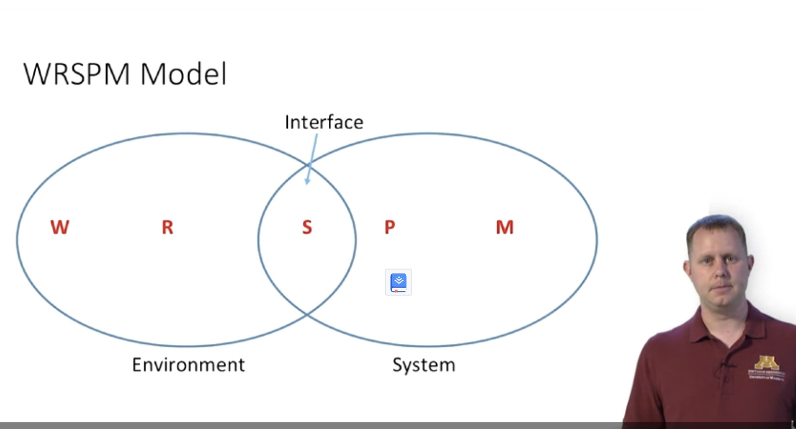

# Requirements

Course materials: [Why do we need requirements?](https://www.coursera.org/learn/software-processes/lecture/pRHmY/why-do-we-need-requirements)

## What are the requirements

### Wgt do we need requirements

- Why we need requirements specification
  - software is intangible
  - User
    - don't know what can be done to solve the problem
    - may not know what they want
- What is a requirements
  - it's a **process**. The process by which we create our shared understanding of both the **problem** that exists and eventually the **needs** of our supposed solution which we want to build that will solve that problem.
    - create high-level descriptions
    - distinguish between "right" and "wrong" system
    - Capture **WHAT** not the **HOW** of the solution
  - The **product** (of that process): the documentation we build from that process
- Why are requirements so important
  - Engineering Argument
    - Spending time upfront saves time later.
    - Proper Planning and time saving
      
  - Economic Argument: the later to catch problem, the higher the cost.

### [Requirements vs Specification](https://www.coursera.org/learn/software-processes/lecture/8ghDF/requirements-vs-specification)

- Write the SRC

  - two type of audiences
    - **users**: so that clients is relatively assured that what they paid for
    - **developers**: to provide enough details to allow the people making the solution, writting code.
  - natural language for communication, but ofen not very precise

- Requirements vs Specifictions

  - **User requirements** are exactly what the user wants the solution to do in the user’s language.
  - **System specification**: more precise or more constraining statement of how the system will meet the user requirements. It is still at the sage of what the solution will do, not how. But it is how our system will meet the user requirements.
  - Summary:
    - Requirements for the user; Specification for the developer
    - Write your requirements in the user language
    - Write your specification in the system language
    - be your that your specification meet the requirements

- [None functional requirements](https://www.coursera.org/learn/software-processes/lecture/cP8No/non-functional-requirements)
  - Def: requirements which don't specify what the system will do, but rather how the system will perform the behaviors
  - Including:
    - define system properties and constraints
    - process requirements
    - often more critical than functional requirements
  - Three classification of none functional requirements
    - Product requirements
    - organizational requirements
    - external requirements
- [WPRSPM](https://www.coursera.org/learn/software-processes/lecture/0TFI5/wrspm):
  - def:
    - keywords: world, requirements, specfication, programm, machine (software host)
    - elements: eh, ev, sv, sh (v- visible, h: element)
  - domain:
    - User requirements (problem domain)
      ```bash
      (develpers' job to transfer requirements to specifiction, there are several layers of abstraction can exisit in between)
      ```
    - Software specification (constraint the solution in the solution domain)
  - it is helpful because
    - Capture the "Right" thing, a way to figture what the requirements specification might be
    - Helps identify the difference between requirement and specification
  - 
  - [further example](https://www.coursera.org/learn/software-processes/lecture/1wPBO/wrspm-model-real-world-example)
