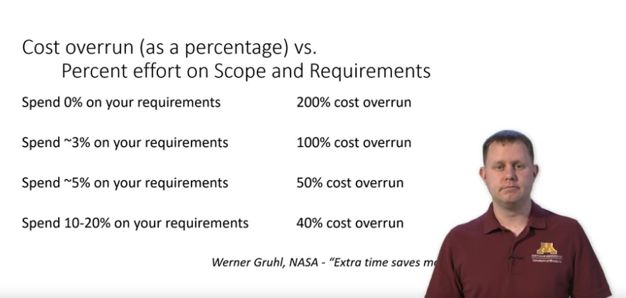

# Requirements

Course materials: [Why do we need requirements?](https://www.coursera.org/learn/software-processes/lecture/pRHmY/why-do-we-need-requirements)

## What are the requirements

- Why we need requirements specification
  - software is intangible
  - User
    - don't know what can be done to solve the problem
    - may not know what they want
- What is a requirements
  - it's a **process**. The process by which we create our shared understanding of both the **problem** that exists and eventually the **needs** of our supposed solution which we want to build that will solve that problem.
    - create high-level descriptions
    - distinguish between "right" and "wrong" system
    - Capture **WHAT** not the **HOW** of the solution
  - The **product** (of that process): the documentation we build from that process
- Why are requirements so important
  - Engineering Argument
    - Spending time upfront saves time later.
    - Proper Planning and time saving
      
  - Economic Argument: the later to catch problem, the higher the cost.
