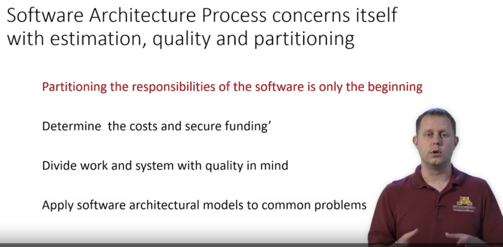

# Software Architecture

**Bad architecture design can't be rescued by good construction.**

- [Software Architecture: Definition](https://www.coursera.org/learn/software-processes/lecture/gkXeB/software-architecture-definition)

  - Paralles
    - Architects are the technical interface between customer and contractor building <the thing>
    - Bad architectural design can not be rescued by good construction
    - Specialist types of projects require architect expertise
    - Schools and styles have emerged
    - Nowdays, from school of thought, about building large scale systems
  - What is architecture:
    - Software architecture is "the structure of the components of a program/system, their interrelationships, and principles and guidelines governing their design and evolution overtime - Garlan & Perry
    - The software architecture of a program/computing system is the structore or structires of the system, which ...
    - _Software architecture is primarily concerned with **partitioning** large systems into smaller ones that can be created separately, that individually have business value, and that can be straightforwardly integrated with one another and with existing systems_. (Michale Whallen, diMinnesota Software Engineering Center)
  - why should we care?
    - good things are well-archictured
    - good architecture is hard
    - mistakes ( the influence is at a large scale level, again, good construction can't save bad architecture)
  - Software architecture mainly about decomposing the system into components (in school thought, they talk about **Enterprize level software** architecture)
    - Each component must have individual business value. (funding)
    - helps organize workforce and resources
    - allows for parallelization
    - helps define the build vs buy questioning and getting funding

- [Software Architecture: Models](https://www.coursera.org/learn/software-processes/lecture/mVUSh/software-architecture-models)

  - school thoughts models

    - Pipe-and-filter
      - (require uniform data input/out format, seen this parttern in nest.js)
      - Scale system by scaling filter/pipes horizontally
    - blackboard (Shared data center)

      - blackboard is the one central database we can go for looking for information
      - blackboard provides a very well defined interface that any components can use it
      - downside: large interface, may have interfaces that are not much useful for a single component

    - Layered system (needs middleware to avoid changing core layer)
    - client-server
    - Event based
      - event manager
      - components

  - customize/adjust based on your needs

- [Software Architecture: Process](https://www.coursera.org/learn/software-processes/lecture/C86cx/software-architecture-process)
  - three major concerns
    - system restructuring:
      - System structuring refers to how the system is decomposed into these several principal subsystems and communications between those subsystems are then identified
      - development team resource distribution
    - control modeling: **Control modeling then, is how architectures create a model of the control relationships between the different parts of the system that's established**. This is particularly true when we have these separate components dealing with the flow of control, not just the interfaces but the **flow of control in communicating with each other,** but how the software will work once it's running.
    - module decomposition:
      - def: And then, modular decomposition is how we identify those subsystem partitions. We are particularly looking at things like simplicity.
      - metrics: maintainablity, security, testability
  - subsystems vs module
    - indepdendent system holds business value
    - component of subsystem which can not function as a standalone system
  - Software Quality attributes
  - 
