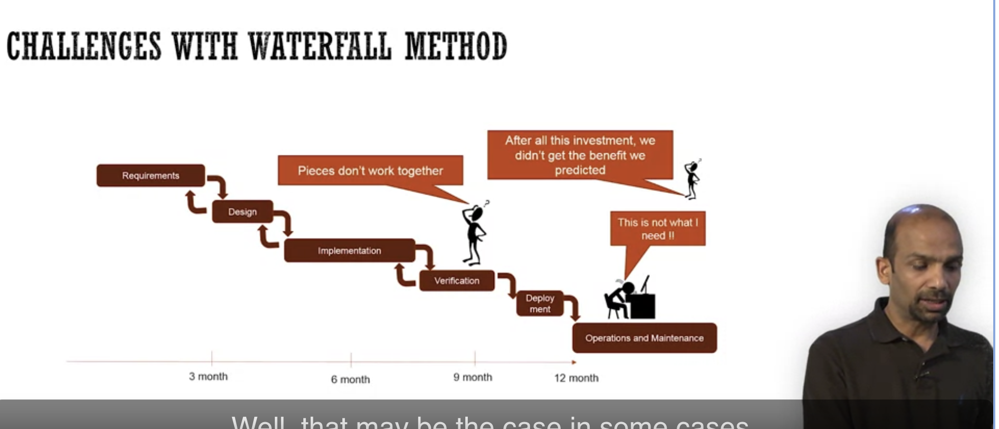
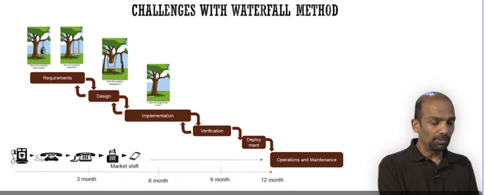
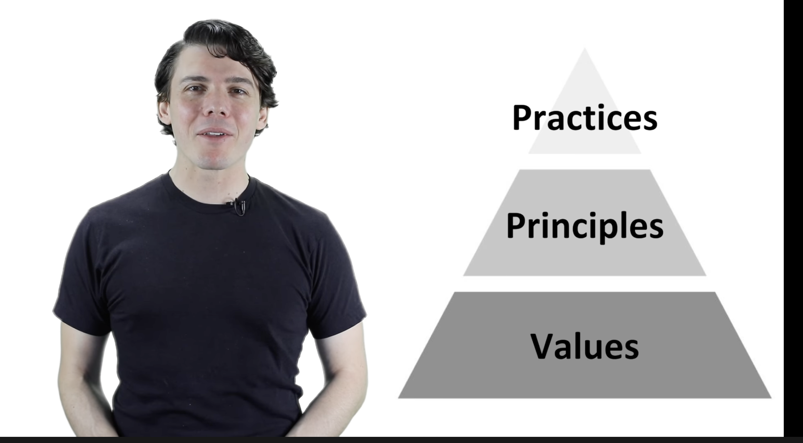
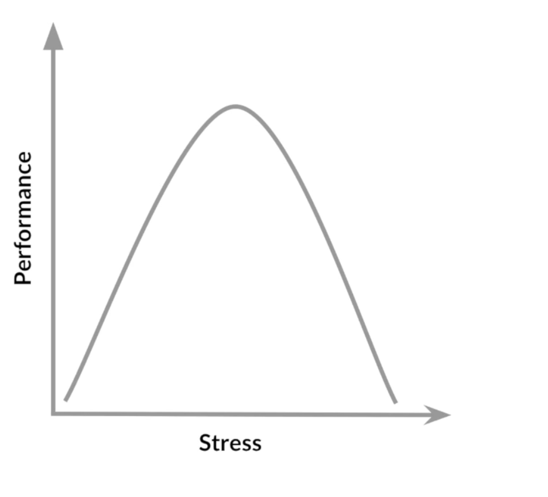
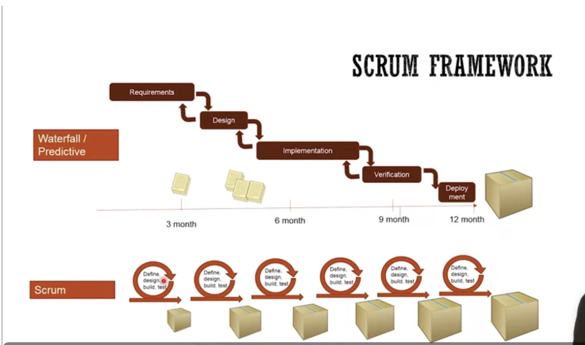
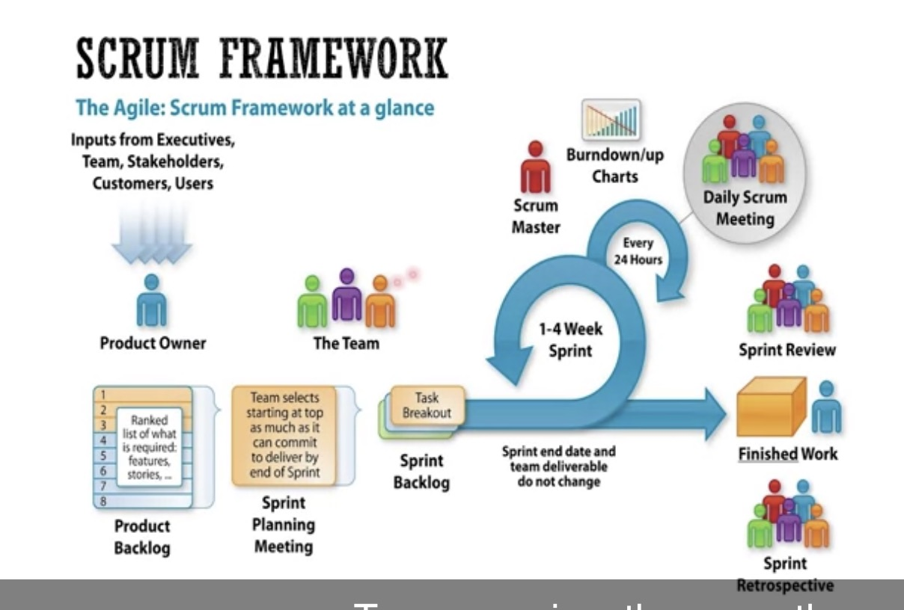

# Why Agiel

## Agiel fundamentals

- [why Agiel](https://www.coursera.org/learn/software-processes/lecture/TIcBg/why-agile)
  - what led the emergence of agile
    - Problems in waterfall software development method
      - pecies don't work together at verification phase (Integration issues between different components of the software go undetected for a long time. During the testing phase, when all the components are integrated, these issues are discovered but it is very late in the process.

2.  Question 2
    ) - requirements are hard to predict (**Very difficult**) - Serveral problems in waterfall:  - Translation issues in waterfall:  - Solution: **reduce the learning cycle** - [agiel manifesto](https://www.youtube.com/watch?v=rf8Gi2RLKWQ)

- [Agile Manifesto and Principles](https://www.coursera.org/learn/software-processes/lecture/XHOt5/agile-manifesto-and-principles)

  - Manifesto

    - **Individual and interactions** over process and tools
    - **Working software** over comphrehensive documentation
    - **Customer collaboration** over contract negotiation
    - **Responding to change** over following a plan

  - [12 principles for agiel](youtube.com/watch?v=5jCc2KByx60)
    

    - Our highest priority is to **satisfy the customer** through **early** and **continuous delivery of** valueable software
    - Welcome changing requirements, even late in development. Agile process harness change for the customers competive advantage. (That's why reduce learning cycle) (**LEARN**)

      - Agile embraces empircism. It is almost a gurantee that we will be more knowledegable once we commence in a project than at the begining.
      - Customers will learn more about their own needs when they see an increment of our work

    - Deliver working software frequently from a couple of weeks to a couple of months, with a prefrence to the shorter timescale.
    - Business people and developers must work together daily throughout the project
      - early stage, product managers work as the proxy of business people to work with developer team daily
      - business people participate in, to make sure the direction is accountable
    - build project around **motivated individuals. Give them the enviroment and support they need**, and trust them to get the job done. (reading book <<drive>>)
      - three things that motivate us most
        - autonomy (sr dev and architect)
        - mastery (sr dev and artchitect)
        - purpose ( product manager)
    - the most efficient and effective method to convey information to and within a development team is face to face conversation.
    - Working software is the primary measure of progress
    - Agile process promote sustainable development. The sponsors, developers, and users should be able to maintan a constant pace indefinitely.
      
    - Continuous attention to technical excellence and good design enhances agility (poor design is the impediment for performance)
    - Simplicity - the art of maximizing the amount of work not done - is essential ( effectiveness)
    - The best architectures, requirements, and designs emerge from self-organizing teams
      - invest in your employees; and employees invest in their self
    - The regular intervals, the team reflects on how to become more effective, then tunes and adjust its behaviors accordingly

## Agile frameworks

- [agiel frameworks](https://www.coursera.org/learn/software-processes/lecture/96g68/agile-frameworks)
  - customize based on your own needs
  - the key to customization is to stay true to the principles and the value of agile, and not bogged down by the rituals or practices of a specific framework.
- [scrum](./https://www.coursera.org/learn/software-processes/lecture/9Zmvt/scrum)
  - (Plan, build ,learn --repeat)
  - 1 ~ 4 weeks as a sprint
  - 
  - 
    - Review is a meeting to get feedback about product from stakholders
    - Retro: review the whole process
